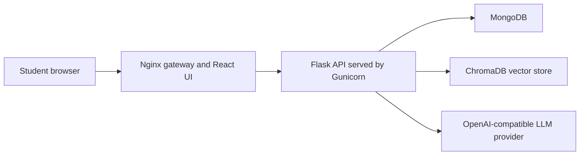

# AIED Guided-LLM Learning Platform

[](https://arxiv.org/abs/2606.01375)
[](https://icce2026.csse.canterbury.ac.nz/)
[](LICENSE)
[](#quick-start)

Research software accompanying the paper **“Beyond Access: Guided LLM
Scaffolding for Independent Learning in Undergraduate Statistics,”** accepted at
the [34th International Conference on Computers in Education (ICCE
2026)](https://icce2026.csse.canterbury.ac.nz/).

The platform combines course videos, practice activities, quizzes, user access
control, and an OpenAI-compatible conversational assistant in a Persian-language
web interface. It was used in a four-week quasi-experimental undergraduate
Probability and Statistics program comparing no-LLM, unrestricted-LLM, and
guided-LLM conditions.

> [!IMPORTANT]
> This repository contains the research platform implementation. It does **not**
> contain participant records, chat transcripts, study-group assignments, the
> participant-level dataset, or the complete statistical-analysis pipeline.

## Paper and conference

- **Paper:** [arXiv:2606.01375](https://arxiv.org/abs/2606.01375) ·
  [DOI](https://doi.org/10.48550/arXiv.2606.01375)
- **Venue:** [ICCE 2026](https://icce2026.csse.canterbury.ac.nz/), organized by
  the Asia-Pacific Society for Computers in Education and hosted by the
  University of Canterbury
- **Location and dates:** Ōtautahi Christchurch, Aotearoa New Zealand ·
  30 November–4 December 2026
- **Track:** Artificial Intelligence in Education / Intelligent Tutoring Systems
  (AIED/ITS)

The guided and unrestricted conditions used the same LLM-enabled platform. The
guided condition was implemented through the study protocol: explicit training
and rules encouraged reasoning-focused help-seeking, stepwise hints,
verification, and ethical use. It should therefore not be interpreted as a
separate hard-coded “guided” model or application mode.

## Features

- Role-based student access with `restricted-student` and `normal-student`
  accounts
- First-login password change plus access-token and rotating refresh-token flows
- Course video catalogue and Persian-language learning interface
- Timed practice and quiz workflows, answer-sheet upload, review, and scoring
- LLM chat histories and conversation summaries
- Vector-backed retrieval using ChromaDB and configurable embedding models
- OpenAI-compatible provider configuration for chat, summarization, and
  embeddings
- Containerized deployment with health checks and an internal MongoDB network

In the study configuration, `restricted-student` accounts did not receive LLM
access, while `normal-student` accounts did. Administrative account creation is
not exposed through public self-registration.

## Architecture



| Layer | Main technologies | Responsibility |
| --- | --- | --- |
| Frontend | React 18, Vite, Ant Design, Tailwind CSS, KaTeX | Learning interface, authentication, chat, videos, practices, and quizzes |
| Gateway | Nginx | Serves the production frontend and proxies API requests |
| Backend | Python 3.11, Flask, Flask-RESTX, Gunicorn | Authentication, course workflows, assessment endpoints, and LLM orchestration |
| Persistence | MongoDB 4.4, ChromaDB | Application records, chat state, summaries, and vector retrieval |
| LLM integration | OpenAI Python SDK | Calls a configurable OpenAI-compatible API |

## Quick start

### Prerequisites

- Docker Desktop or Docker Engine with Docker Compose v2
- A valid API key for an OpenAI-compatible provider
- Approximately 4 GB of available memory for the initial local build

### 1. Configure the backend

From the repository root, create a private environment file from the example.

PowerShell:

```powershell
copy-item .\platform\backend\.env.example .\platform\backend\.env
```

Bash:

```bash
cp platform/backend/.env.example platform/backend/.env
```

Generate two independent random secrets:

```bash
python -c "import secrets; print(secrets.token_hex(32))"
python -c "import secrets; print(secrets.token_hex(32))"
```

Open `platform/backend/.env` and set:

```dotenv
SECRET_KEY=<first-generated-value>
JWT_SECRET_KEY=<second-generated-value>
LLM_API_KEY=<your-provider-api-key>
```

The backend intentionally refuses to start when `LLM_API_KEY` is empty. Never
commit `platform/backend/.env`; it is excluded by `.gitignore` and the Docker build
context.

### 2. Build and start the stack

```bash
docker compose -f platform/docker-compose.yml up --build -d
```

The first build can take several minutes because Docker downloads the base
images and installs the frontend and backend dependencies.

### 3. Verify the deployment

```bash
docker compose -f platform/docker-compose.yml ps
```

Open <http://localhost:8080> and confirm the API health endpoint:

```bash
curl http://localhost:8080/api/health
```

Expected response:

```json
{"status":"healthy"}
```

To use a different host port, set `AIED_HTTP_PORT` before starting Compose. For
example, in PowerShell:

```powershell
$env:AIED_HTTP_PORT = "18080"
docker compose -f platform/docker-compose.yml up --build -d
```

### 4. Stop the stack

```bash
docker compose -f platform/docker-compose.yml down
```

This preserves the named MongoDB volume. To intentionally reset local database
state as well, run `docker compose -f platform/docker-compose.yml down --volumes`.

## Configuration

Runtime configuration is read from `platform/backend/.env`.

| Variable | Required | Default in `.env.example` | Purpose |
| --- | --- | --- | --- |
| `FLASK_ENV` | Yes | `dev` | Selects the Flask configuration profile |
| `DB_NAME` | Yes | `aied_db` | MongoDB database name |
| `MONGO_DB_CONNECTION_STRING` | Yes | `mongodb://mongo:27017` | MongoDB connection used inside Compose |
| `SECRET_KEY` | Yes | Empty | Flask application secret; generate a unique random value |
| `JWT_SECRET_KEY` | Yes | Empty | JWT signing secret; use a different random value |
| `JWT_ACCESS_TOKEN_EXPIRES` | No | `3600` | Access-token lifetime in seconds |
| `JWT_REFRESH_TOKEN_EXPIRES` | No | `604800` | Refresh-token lifetime in seconds |
| `LLM_BASE_URL` | Yes | `https://api.avalai.ir/v1` | Base URL of the OpenAI-compatible API |
| `LLM_API_KEY` | Yes | Empty | Provider API credential |
| `LLM_MODEL` | No | `gpt-4o-mini` | Main conversational model |
| `LLM_SUMMARY_MODEL` | No | `gpt-4o-mini` | Conversation-summary model |
| `LLM_EMBEDDING_MODEL` | No | `text-embedding-3-large` | Embedding model used for retrieval |
| `AIED_REGISTER_URL` | No | Empty | Optional registration URL used by `create_user.py` |

Model names and availability depend on the selected provider. Update the model
variables when the provider exposes different identifiers.

## Accounts and access modes

Students can register through the web interface. For controlled research setup,
an account can also be created with the command-line helper:

```bash
python platform/backend/scripts/create_user.py \
  --username student01 \
  --first-name Student \
  --last-name Example \
  --role restricted-student \
  --api-url http://localhost:8080/api/api/auth/register
```

The helper prompts for the password without echoing it. Public registration
accepts only the two student roles shown below.

| Role | LLM access | Intended use |
| --- | --- | --- |
| `restricted-student` | No | No-LLM comparison condition |
| `normal-student` | Yes | LLM-enabled learning conditions |

The guided-versus-unrestricted distinction was established by instructional
scaffolding in the study protocol rather than by assigning two different
application roles.

## Repository layout

| Path | Contents |
| --- | --- |
| `platform/backend/app/auth/` | Registration, login, password changes, token refresh, and logout |
| `platform/backend/app/chatbot/` | LLM client, chat services, summaries, and vector retrieval |
| `platform/backend/app/course/` | Course metadata and course endpoints |
| `platform/backend/app/practice/` | Practice activities, uploads, review, and included materials |
| `platform/backend/app/quiz/` | Quiz workflows, questions, answer sheets, and scoring |
| `platform/backend/app/vidoes/` | Video catalogue and endpoints; directory name retained for compatibility |
| `platform/backend/scripts/` | Research administration and export utilities |
| `platform/frontend/src/` | React application source |
| `platform/frontend/nginx/` | Production web-server and API-proxy configuration |
| `platform/docker-compose.yml` | Local multi-container deployment |

Some scripts under `platform/backend/scripts/` are preserved research utilities tied to
the original study workflow. Several expect private CSV/JSON inputs that are
deliberately excluded, and some seed scripts replace existing collections. They
are not required for the Quick Start and should be reviewed before use against
any non-disposable database.

## Research data and privacy

The public repository excludes all participant-level or deployment-generated
records, including:

- student account exports and group assignments;
- attendance and assessment exports;
- chat transcripts and database dumps;
- uploaded answer sheets and generated exports;
- local environment files, credentials, and TLS material.

The application should be configured with synthetic accounts and a fresh
database for demonstrations. Do not publish data collected from learners without
the applicable consent, ethics approval, institutional policy review, and
de-identification process.

## Verification status

The release candidate was smoke-tested on 4 August 2026 with Docker Engine
28.0.4 and Docker Compose 2.34.0.

| Check | Result |
| --- | --- |
| Compose configuration validation | Passed |
| Backend and frontend image builds | Passed |
| MongoDB, backend, and frontend health checks | Passed |
| Frontend response and React mount point | HTTP 200; passed |
| Registration and required first-login password change | Passed |
| Login, access token, refresh-token rotation, and logout | Passed |
| Public attempt to register an administrator | Rejected with HTTP 400 |
| Reuse of a revoked refresh token | Rejected with HTTP 401 |
| Critical/traceback entries in smoke-test logs | None observed |

The smoke test used a non-secret placeholder solely to exercise startup paths;
it did not call an external LLM. A live provider call therefore remains an
environment-specific integration check.

## Known limitations

- This is a research prototype, not a production-ready learning management
  system.
- The repository does not yet include a comprehensive automated test suite.
- A fresh deployment contains no original study participants or collected study
  records.
- The complete data-processing and statistical-analysis workflow for the paper
  is not part of this repository.
- Public Internet deployment requires additional authorization review,
  transport security, rate limiting, monitoring, backup, and privacy controls;
  see [SECURITY.md](SECURITY.md).

## Citation

If this repository supports your research, cite the accompanying paper. GitHub
also exposes structured software and paper citation metadata from
[`CITATION.cff`](CITATION.cff).

```bibtex
@article{amanlou2026beyond,
  title   = {Beyond Access: Guided LLM Scaffolding for Independent Learning in Undergraduate Statistics},
  author  = {Mohammad Amanlou,  and Yasaman Amou-Jafari,  and Mehrad Liviyan,  and Fatemeh Boloukazari,  and Fereshte Bagheri,  and Elahe Khodaverdi Nadrabadi,  and Shahab Sherafat,  and Dr.Behnam Bahrak, },
  year    = {2026},
  journal = {arXiv preprint arXiv:2606.01375},
  doi     = {10.48550/arXiv.2606.01375}
}
```

## Security

This code handles authentication and learner-generated content. Review
[`SECURITY.md`](SECURITY.md) before any network-accessible deployment. Please do
not disclose suspected vulnerabilities or real learner data in a public issue.

## License

The source code is released under the [MIT License](LICENSE).

The MIT license does not grant additional rights to participant data (which is
not included) or to third-party and non-code materials such as course PDFs,
photographs, fonts, and other media. Those materials remain subject to their
respective ownership and terms.
